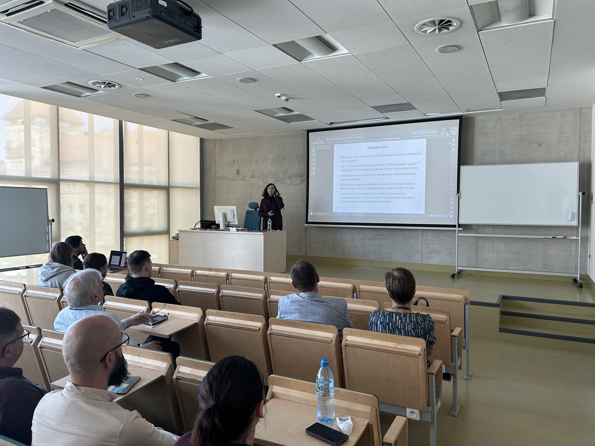
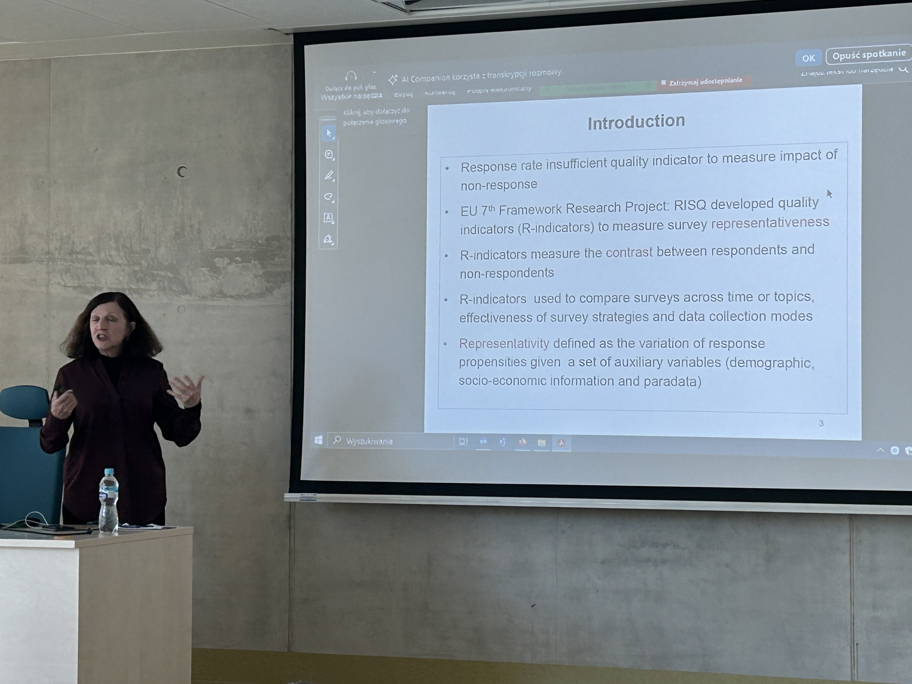
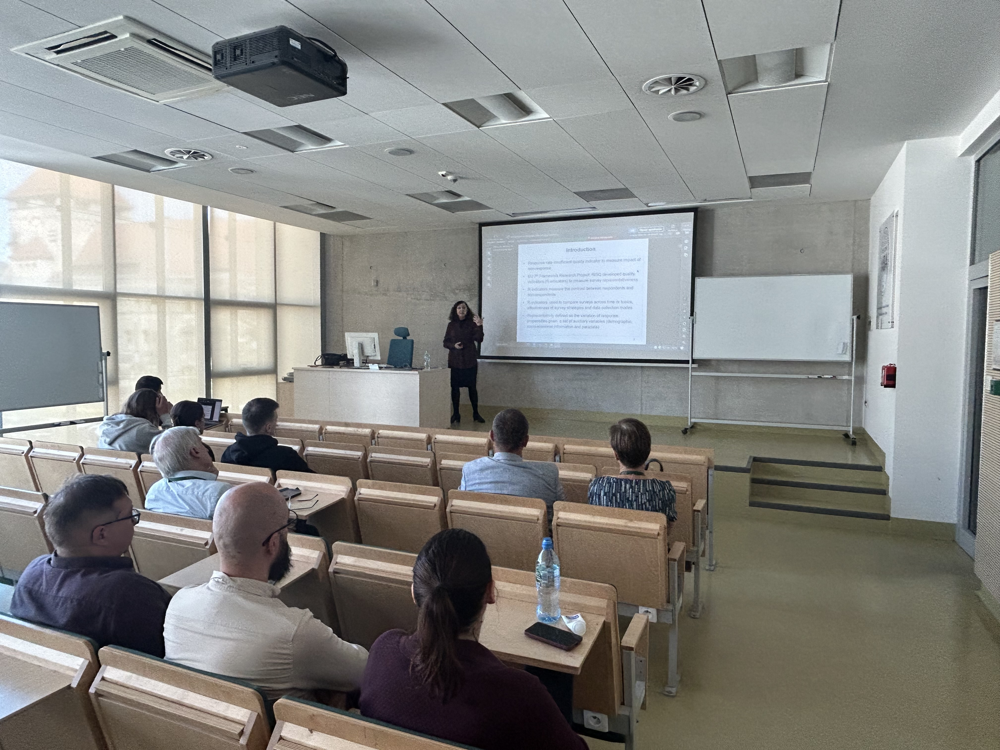

::: {.content-visible when-profile="english"}

Prof. Natalie Shlomo visited Department of Statistics between 6th and 9th of May 2025. During her stay she was involved in two events on 8th of May:

+ Seminar on **Statistical Dsclosure Control** at Statistical Office in Poznań
+ Seminar on **"R-indicators for Assessing Representativeness for Surveys, Administrative Data and Non-probability Samples"**

*Abstract*:  In this presentation, we focus on the use of Representativity (R-) Indicators to assess representativeness in survey and non-survey data. We start with the initial purpose of developing R-indicators for use in adaptive survey designs in probability-based surveys. Through the analysis of R-indicators, we can build profiles (characteristics) of the data units where more or less attention is required in the data collection. We present an application of an adaptive survey design for the Dutch Crime Victimisation Survey. R-indicators have been extended to allow for assessing representativeness in survey data when information about nonrespondents is not available. For this purpose, we can use population marginal and cross-tabulations to use as ‘plug-ins’ under a linear regression for estimating response propensities and R-indicators. We demonstrate with an application where R-indicators were successfully applied to assess representativeness in the 2011 EU-SILC datasets using 2011 European census counts as population benchmarks. More recently, R-indicators have been developed to assess representativeness in non-survey data sources, namely administrative data and non-probability samples. We show applications on assessing representativeness in non-survey data, making use of high-quality survey data collections to produce the population benchmarks.

**Prof Natalie Shlomo's lectures were financed by funds from the Ministry of Science awarded under the ‘Regional Excellence Initiative’ programme for the project ‘Poznań University of Economics for Economy 5.0: Regional Initiative - Global Effects (IREG)’.**

 

:::

::: {.content-visible when-profile="polish"}

Prof. Natalie Shlomo odwiedziła Katedrę Statystyki między 6 a 9 maja 2025 roku. Podczas pobytu uczestniczyła w dwóch wydarzeniach (8 maja):

+ Seminarium na temat **statystycznej kontroli ujawniania danych** w Urzędzie Statystycznym w Poznaniu
+ Seminarium na temat **„R-indicators for Assessing Representativeness for Surveys, Administrative Data and Non-probability Samples”**.

Abstract:  In this presentation, we focus on the use of Representativity (R-) Indicators to assess representativeness in survey and non-survey data. We start with the initial purpose of developing R-indicators for use in adaptive survey designs in probability-based surveys. Through the analysis of R-indicators, we can build profiles (characteristics) of the data units where more or less attention is required in the data collection. We present an application of an adaptive survey design for the Dutch Crime Victimisation Survey. R-indicators have been extended to allow for assessing representativeness in survey data when information about nonrespondents is not available. For this purpose, we can use population marginal and cross-tabulations to use as ‘plug-ins’ under a linear regression for estimating response propensities and R-indicators. We demonstrate with an application where R-indicators were successfully applied to assess representativeness in the 2011 EU-SILC datasets using 2011 European census counts as population benchmarks. More recently, R-indicators have been developed to assess representativeness in non-survey data sources, namely administrative data and non-probability samples. We show applications on assessing representativeness in non-survey data, making use of high-quality survey data collections to produce the population benchmarks.

**Wykłady prof. Natalie Shlomo sfinansowano ze środków Ministra Nauki przyznanych w ramach Programu „Regionalna inicjatywa doskonałości” na realizację projektu „Uniwersytet Ekonomiczny w Poznaniu dla Gospodarki 5.0: Inicjatywa regionalna – efekty globalne (IREG)”.**

 

:::
